# API Design : Create a Reverse Proxy from OpenAPI Spec

*Duration : 10 mins*

*Persona : API Team*

# Use case

You have a requirement to create a reverse proxy for taking HTTP requests from the Internet and forward them to an existing backend service. You have decided to follow a design first approach & built a reusable component, a specification which can be used to build API Proxies, generate API documentation, generate API test cases using OpenAPI Specification format. You would like to generate an Apigee API Proxy by using the OpenAPI Specification (Swagger) instead of building the API Proxy from scratch.

# How can Apigee Edge help?

Apigee Edge enables you to quickly expose backend services as APIs. You do this by creating an API proxy that provides a facade for the backend service that you want to expose. Apigee Edge out of the box supports the OpenAPI specification, allowing you to auto-generate API Proxies. Apigee Edge also has an OpenAPI specification editor & store which you can use to maintain your OpenAPI specifications.

The API proxy decouples your backend service implementation from the API that developers consume. This shields developers from future changes to your backend services. As you update backend services, developers, insulated from those changes, can continue to call the API uninterrupted.

In this lab, we will see how to create a reverse proxy, that routes inbound requests to existing HTTP backend services using a readily available OpenAPI specification.

# Pre-requisites

Basic understanding of [OpenAPI Specification](https://github.com/OAI/OpenAPI-Specification) (Swagger)

# Instructions

* Go to [https://apigee.com/edge](https://apigee.com/edge) and log in. This is the Edge management UI.

* Select **Develop → Specs** in the side navigation menu

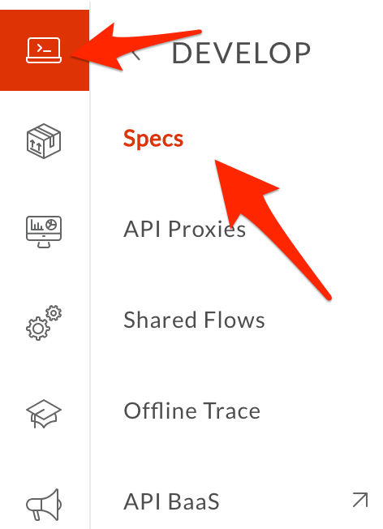

* Click **+Spec.** Click on **Import URL** to add a new spec from existing source.

* Enter spec details. Replace **{your-initials}** with the initials of your name.

  * File Name: **{your-initials}**_mock_target_api_spec

  * URL: [https://raw.githubusercontent.com/rmistry75/devjam3/feature/update_sample_backend/Labs/VirtualAPIJam/Lab%201%20API%20Design%20-%20Create%20a%20Reverse%20Proxy%20from%20OpenAPI%20Spec/assets/ApigeeMockTargetSwagger.yml](https://raw.githubusercontent.com/rmistry75/devjam3/feature/update_sample_backend/Labs/VirtualAPIJam/Lab%201%20API%20Design%20-%20Create%20a%20Reverse%20Proxy%20from%20OpenAPI%20Spec/assets/ApigeeMockTargetSwagger.yml)

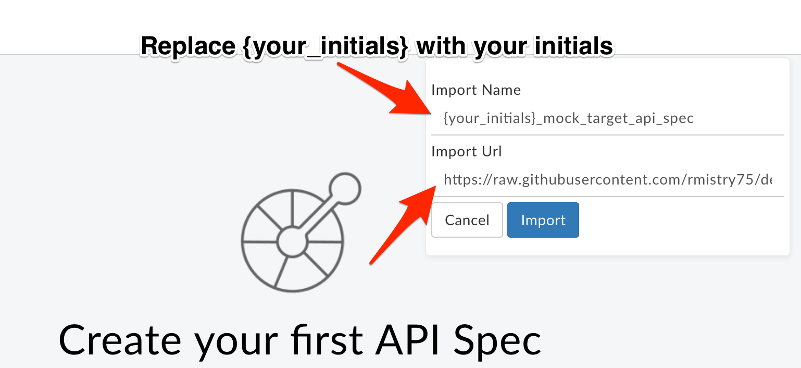

**	**

* Verify the values and click **Import**.

* Spec has been imported into Apigee Edge & Ready to use. You should see your spec in the list. For example,

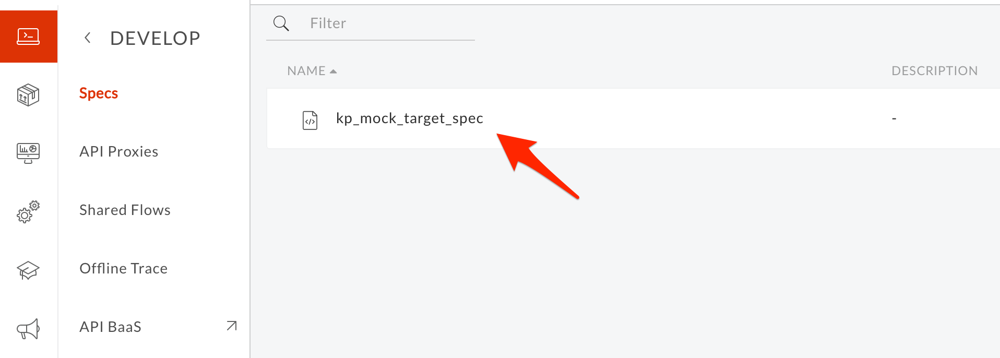

* Click on **{your-initials}**_mock_target_spec from the list to access Open API spec editor & interactive documentation that lists API details & API Resources.

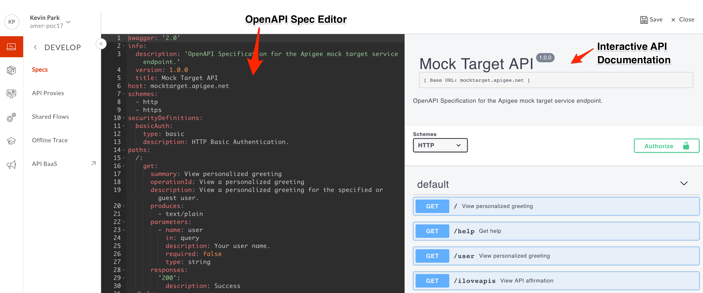

* It’s time to create Apigee API Proxy from Open API Spec. Click on **Develop > API Proxies** from side navigation menu.

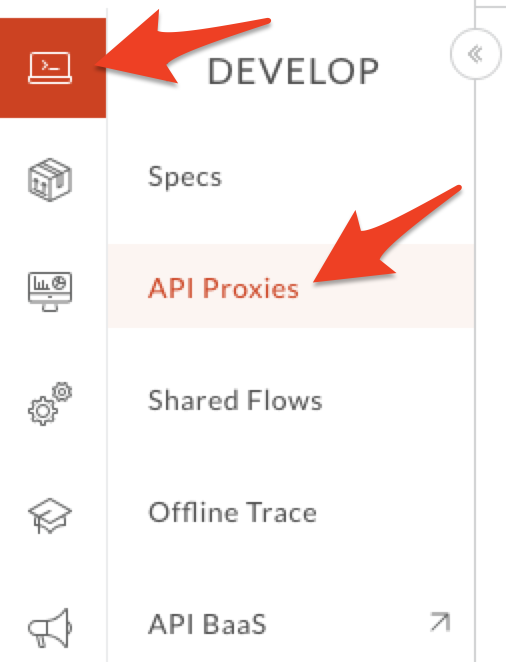

* Click **+Proxy** The Build a Proxy wizard is invoked.

* Select **Reverse proxy**, Click on **Use OpenAPI** below reverse proxy option.

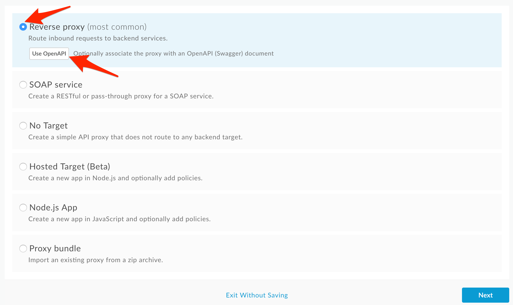

* You should see a popup with list of Specs. Select **{your-initials}**_mock_target_api_spec and click **Select.**

* You can see the selected OpenAPI Spec URL below the Reverse Proxy option, Click **Next** to continue.

* Enter details in the proxy wizard. Replace **{your-initials}** with the initials of your name.

  * Proxy Name: **{your_initials}**_mock_target_proxy

  * Proxy Base Path: /**{your_initials}**_mock_target_proxy

  * Existing API: Observe the field value which is auto filled from OpenAPI Spec.

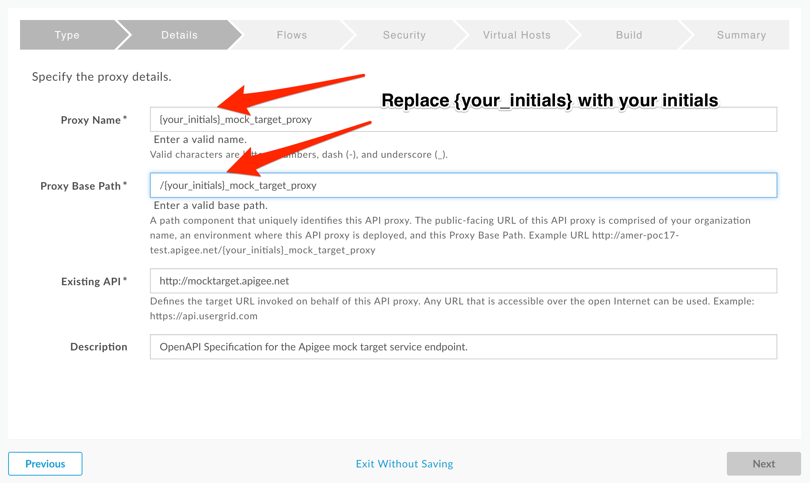

* Verify the values and click **Next**.

* You can select, de-select list of API Proxy Resources that are pre-filled from OpenAPI Spec. Select all & Click on **Next**

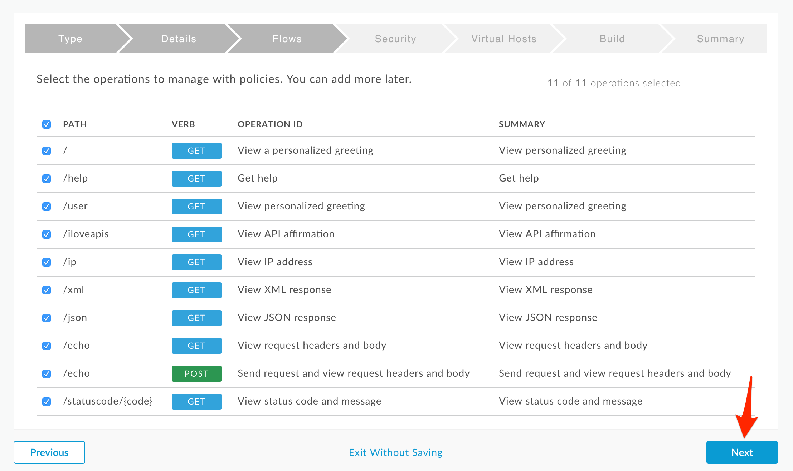

* Select **Pass through (none)** for the authorization in order to choose not to apply any security policy for the proxy. Click Next.
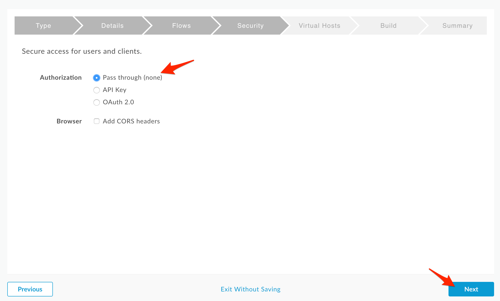

* Go with the **default Virtual Host** configuration.
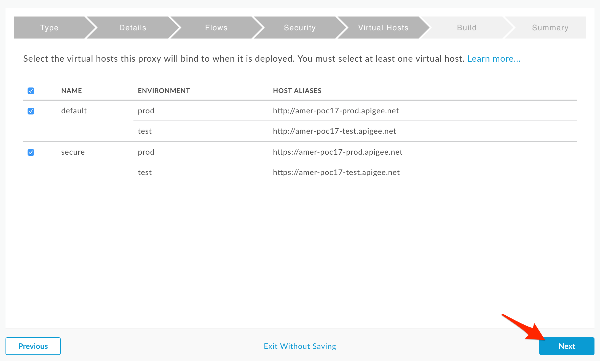

* Ensure that only the **test** environment is selected to deploy to and click **Build and Deploy**

* Once the API proxy is built and deployed **click** the link to view your proxy in the proxy editor.

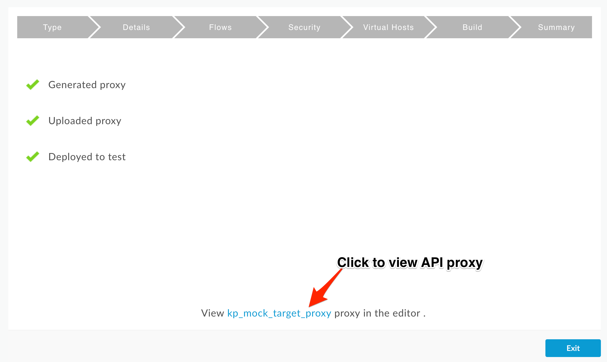

* You should see the proxy **Overview** screen
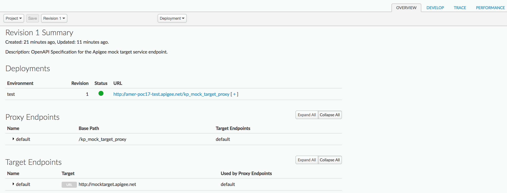

* *Congratulations!* ...You have now built a reverse proxy for an existing backend service.

* Let us test the newly built API proxy using the [REST Client](https://apigee-rest-client.appspot.com/). Open the REST Client on a new browser window.  

* Copy the URL for your API proxy.

* Paste the link into the REST Client and make a GET call

* You should see a success response similar to this -

# Save the API Proxy

* Let’s save the API Proxy locally as an API Bundle so that we can reuse it in other labs.

* Save the API Proxy by downloading the proxy bundle, See screenshot below for instructions.

# Lab Video

If you like to learn by watching, here is a short video on creating a reverse proxy using Open API Specification - [https://www.youtube.com/watch?v=3XBG9QOUPzg](https://www.youtube.com/watch?v=3XBG9QOUPzg)

# Earn Extra-points

Now that you have created a reverse proxy using an OpenAPI spec, click on the "Develop" tab & explore the flow conditions populated from the OpenAPI spec. Also, explore the OpenAPI Spec editor where you can edit the OpenAPI specification & test the API requests. Finally, explore the "Trace" tab in the proxy overview page.

# Quiz

1. How do you download (backup) the proxy you just created ?

# Summary

That completes this hands-on lesson. In this simple lab you learned how to create a proxy for an existing backend using OpenAPI Specification and Apigee Edge proxy wizard.

# References

* Useful Apigee documentation links on API Proxies -

    * Build a simple API Proxy - [http://docs.apigee.com/api-services/content/build-simple-api-proxy](http://docs.apigee.com/api-services/content/build-simple-api-proxy)

    * Best practices for API proxy design and development - [http://docs.apigee.com/api-services/content/best-practices-api-proxy-design-and-development](http://docs.apigee.com/api-services/content/best-practices-api-proxy-design-and-development)

* Watch this 4minute video on "Anatomy of an API proxy" - [https://youtu.be/O5DJuCXXIRg](https://youtu.be/O5DJuCXXIRg)

# Rate this lab

How did you like this lab? Rate [here](https://goo.gl/forms/G8LAPkDWVNncR9iw2).

Now go to [Lab-2](../Lab%202%20API%20Security%20-%20Securing%20APIs%20with%20API%20Keys)
